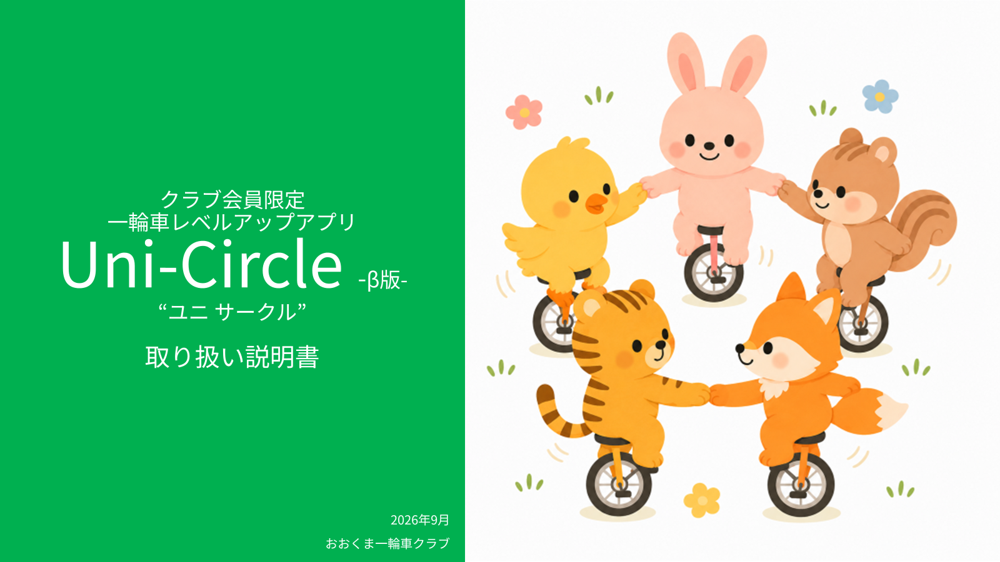
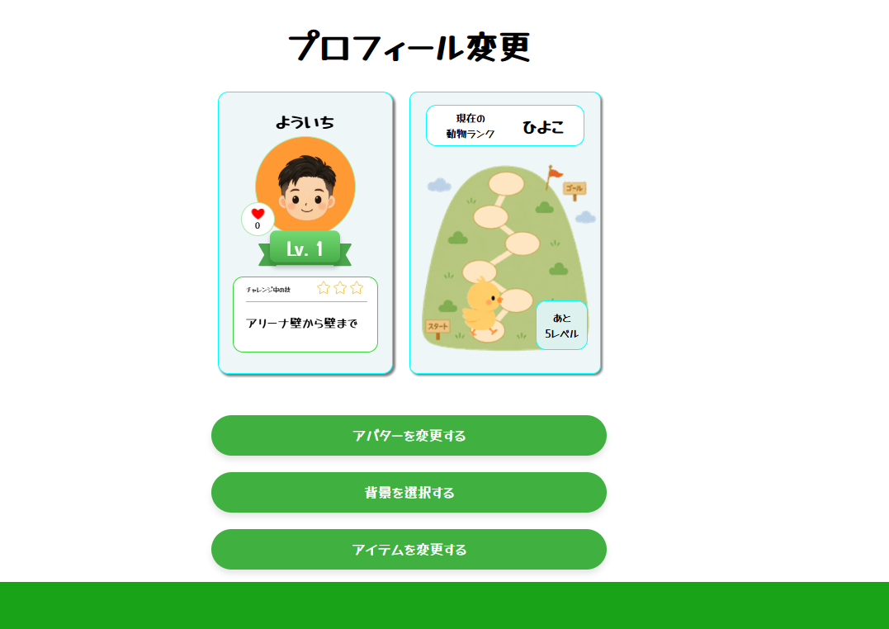
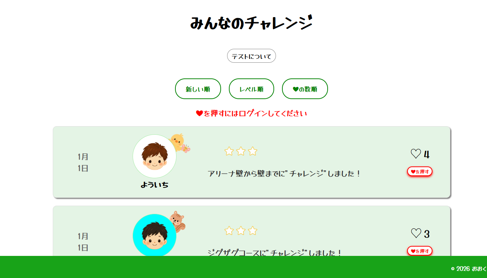
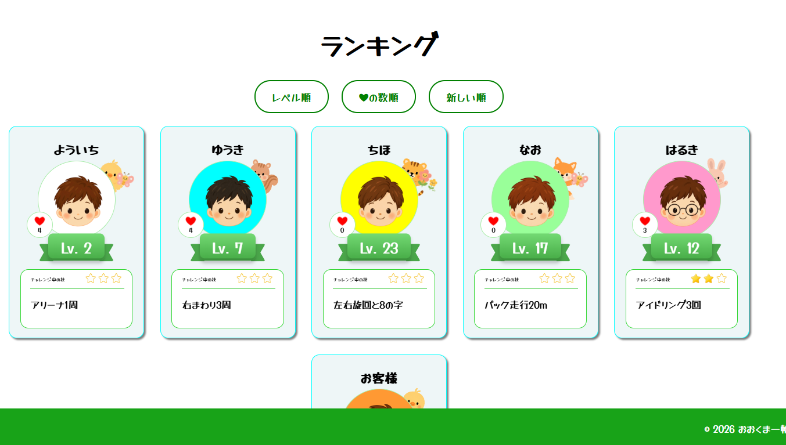
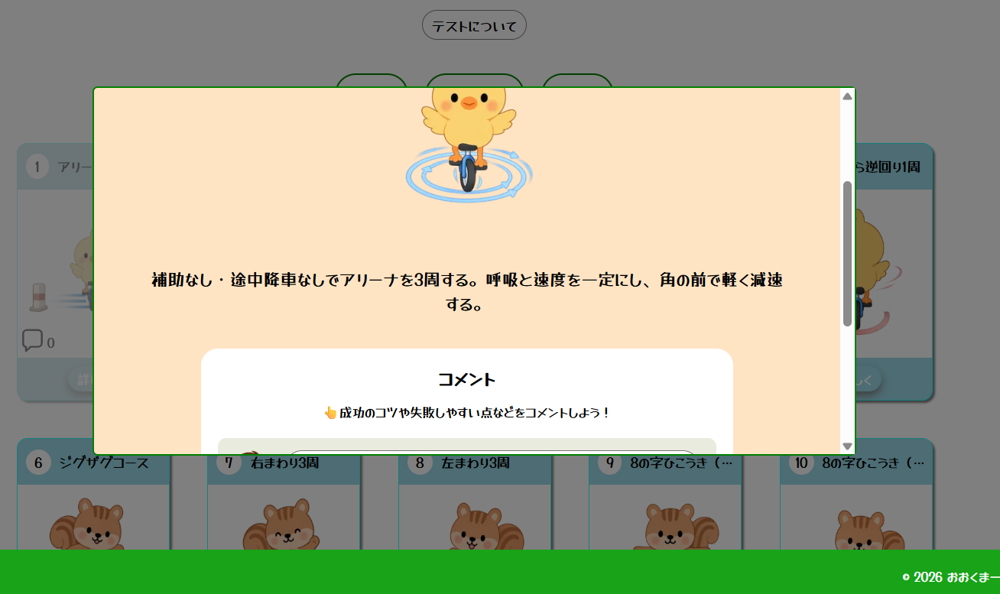
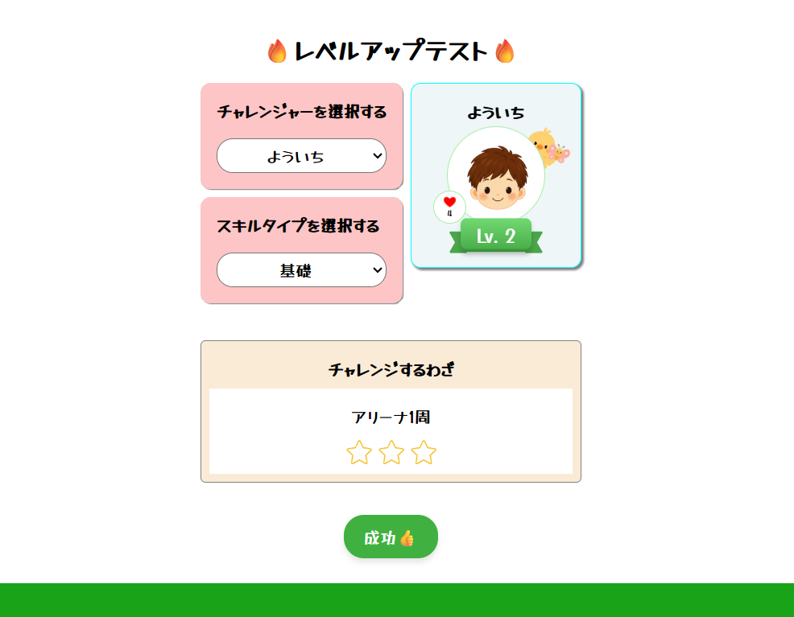
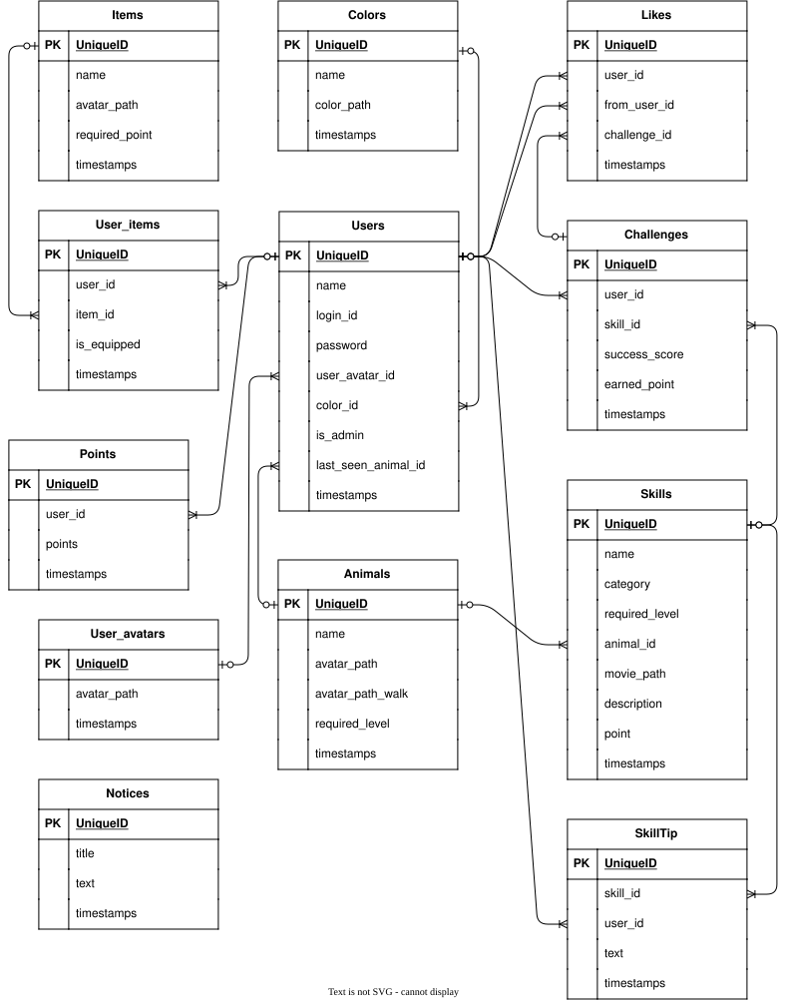

# 一輪車レベルアップアプリ

# **「Uni-Circle（ユニサークル）」**
一輪車を練習する子ども・大人が、楽しみながら技を習得し、仲間と成長を共有できるレベルアップ支援アプリです。
一輪車の英語Unicycleと、メンバーが輪になって練習・交流するイメージのCircleを組み合わせて「Uni-Circle」と名付けました。

## URL

https://app.unicircle-jp.com
※ログインユーザー限定のアプリです。  
  
  ユーザー向け説明書  
  https://drive.google.com/file/d/1_aACAXzeJdxGb-02DWk3OnyRDp3uhhQ8/view?usp=drive_link  
  おおくま一輪車クラブホームページ  
  https://sites.google.com/view/okumaunicycle/

## 開発背景

娘が学校で一輪車に熱中して、ブームになったことをきっかけに、地域で一輪車クラブを立ち上げました。  
クラブでは、集客、講師招聘、会計、補助金申請、会場予約などの運営を行う中で、次のような課題を感じました。

- 一輪車は「乗れるようになる」ことが最初の大きな目標となり、その後の技に挑戦せず練習をやめてしまうことがある
- 一輪車には回転、ジャンプ、片足走行、団体演技など多くの技があるが、その存在が十分知られていない
- 個人練習が中心になるため、他のメンバーが「何を練習しているか」「どの技までできているか」が分かりにくい
- 指導者側もメンバーそれぞれのレベルを把握することが難しい
- 技術の高いメンバーだけが評価されると、初心者のモチベーションが下がりやすい  

そこで、
**「一輪車の技術を可視化し、技術レベルだけでなく、挑戦そのものを評価できる仕組み」**
を作ることを目的としてUni-Circleを開発しました。

## 解決したい課題

Uni-Circleでは、主に次の3つの課題解決を目指しています。

1. 練習を継続するモチベーション  
レベル・動物ランク・ポイントなどを使い、自分の成長を視覚的に確認できるようにしました。
2. 仲間とのコミュニケーション  
チャレンジ履歴をメンバー全員で共有し、❤ボタンによって挑戦したメンバーを応援できるようにしました。

   上級者だけでなく  
   **「たくさん挑戦した人も応援される」**
   設計を意識しています。

3. クラブ運営・指導負担の軽減  
管理者がメンバーのレベル、チャレンジ履歴、取得技などを確認できるため、練習メニュー作成やチーム編成に活用できます。

## 主な機能
1. ログイン  
クラブ入会時に発行されたID・パスワードでログインします。  
1ユーザーにつき1IDを発行し、新規ユーザー登録は管理者のみが行います。  
クラブ会費の支払いとユーザー登録を紐づけることで、実際のクラブ運営とシステムを連動させています。

2. プロフィール編集  
ユーザーは以下の情報を編集できます。
   - ニックネーム
   - アバター
   - 背景カラー
   - パスワード

   アバターは子供・大人を含む複数のイラストから選択できます。
   また、チャレンジなどで獲得したポイントを利用してアイテムを取得できます。

3. レベル・動物ランク  
一輪車の技術をレベル1～25に分類しています。  
レベルアップするごとに山を登っていくようなUIと、5レベルごとにアニメーションとともに動物ランクが変化します。  
数字だけでレベルを表示するのではなく、動物を使うことで子供でも自分の成長を直感的に把握できるようにしました。

4. チャレンジ機能  
技取得のためのレベルアップテストを行います。  
管理者が技の成功を3回確認すると合格となり、次のレベルへ進みます。  
合否に関わらずチャレンジ結果はDBに保存され、メンバー全員がチャレンジ履歴から確認できます。

5. 応援機能  
チャレンジ履歴には❤ボタンを設置しています。  
他のメンバーのチャレンジを応援することで、「技術が高い人だけが評価される」のではなく
**「挑戦している人も評価される」**
コミュニティを目指しています。

6. ランキング  
クラブメンバーの
   - 現在レベル
   - 動物ランク
   - ❤獲得数  
を一覧表示します。
指導者がメンバーのレベルを把握したり、練習チームを編成する際にも利用できます。

7. 技一覧  
一輪車に乗れるようになるまでの基礎技から、上級技までを一覧表示します。
取得した技にはクリア表示がつきます。
各技には以下の情報を登録しています。
   - 技名
   - カテゴリ
   - 成功するためのコツ
   - 獲得できるポイント
   - メンバーからのコメント  

   技の習得方法をアプリ上で確認できるため、次に目標とする技が明確になります。

8. 技へのコメント・Tip投稿  
技ごとに、メンバーが攻略のコツや練習方法を投稿できます。
自分の失敗や成功について言語化することで、属人的ではない技の練習ポイントを学べ、指導者がいない時間でも自主練習が出来ます。  
遠方から招聘している指導者もその場に居合わせることなく状況を把握し、コメントでコツを指導できます。  
指導者だけが知識を持つのではなく、
**「クラブ内に練習ノウハウを蓄積する」** ことを目的としています。

## 管理者機能
管理者には一般ユーザーとは別に管理機能を用意しています。  
 - ユーザー登録  
  クラブへの入会・会費支払い後、管理者がユーザーを登録します。  
  
 - ユーザー削除  
  退会・卒業したメンバーを削除できます。  
  
 - パスワードリセット  
 ユーザーがパスワードを忘れた場合、管理者が再設定できます。  
  
 - レベルアップ判定  
  チャレンジを行ったメンバーの技を確認し、成功回数を入力します。3回成功した場合は合格となり、レベルアップします。
  
  
  
## 使用技術
  
**Frontend**
- React 19.3.0
- TypeScript 4.9.5
- React Router 6.30.6
- HTML/CSS
- Zustand 5.0.14
- Axios 1.18.0
  
**Backend**
- Laravel 13.14.0
- PHP
- REST API
- Laravel Sanctum 4.3
  
**Database**
- MySQL(本番)
- SQLite(ローカル開発)
  
**Infrastructure**
- Railway
- nginx
- XServer Domain
  

**Development / Tools**
- Composer
- npm
- Git / GitHub

**Testing**
- Jest
- React Testing Library
- user-event
- Axios Mock

**必要環境**

- PHP 8.3以上  
- Composer 2系
- Node.js 20.9以上
- ブラウザで開くURL:http://localhost3000  
  

## システム構成
FrontendとBackendを分離したSPA構成としています。  
ReactからAxiosを使用してLaravel REST APIへ通信し、
LaravelではEloquentを利用してDatabaseからデータを取得・更新しています。  
認証にはLaravel Sanctumを使用し、
Cookieベースでログイン状態を管理しています。  
  
ユーザー  
   ↓  
React / TypeScript  
   ↓  
Axios / REST API  
   ↓  
Laravel  
   ↓  
Eloquent  
   ↓  
MySQL  
  
認証：Laravel Sanctum  
Frontend / Backend：Railway  
独自ドメイン：XServerで取得・管理  
  
## 認証
Laravel Sanctumを使用した認証を採用しています。未ログインユーザーはクラブ内情報へアクセスできないようにしています。  
また、管理者専用機能については一般ユーザーからアクセスできないよう権限を分離しています。  
  

## ER図
 
  
主なテーブル：  

users  
skills  
skill_tips  
challenges  
likes  
colors  
animals  
user_avatars  
items  
user_items  
points  
notices  
  

## テスト
FrontendではJest / React Testing Libraryを使用し、主要なユーザーフローを中心にテストを実装しています。

全ての表示項目を網羅するのではなく、「ユーザーが実際に行う重要な操作が正常に機能する」ことを重視してテスト対象を選定しました。

## 主なテスト対象
- メンバー情報の表示
- Like（❤）操作
- ログイン
- プロフィール表示
- プロフィール更新
- チャレンジ履歴
- 管理者機能
- 権限による表示制御

API通信を伴うコンポーネントについてはAxiosをMock化し、Laravel APIやDatabaseの状態に依存せず単体でテストできるようにしています。

## 工夫した点
1. 「上手さ」だけではなく「挑戦」を評価  
一般的なランキングでは技術レベルの高いユーザーが上位になります。  
しかし初心者が多い地域クラブでは、それだけではモチベーションにつながらないと考えました。  
そのため、チャレンジ履歴と❤機能を組み合わせ、**挑戦回数が多い人にも自然に応援が集まる設計**としました。
  
2. 子供でも理解できるUI  
主な利用者には小学生も含まれます。
そのため数字・文章だけではなく
   - 動物
   - アバター
   - 山登り
   - ❤
   - アイコン  
などを利用して直感的に操作できるUIを意識しました。  
  
3. 現実のクラブ運営とシステムを連携  
単独で完結するアプリではなく、

   入会  
   　↓  
   会費支払い  
   　↓  
   ユーザー登録  
   　↓  
   練習  
   　↓  
   チャレンジ  
   　↓  
   管理者  
   　↓  
   レベルアップ  
  
という実際のクラブ運営フローにアプリを組み込みました。
  
4. 管理者の運営負担軽減  
これまで指導者の記憶や紙で管理していた  
   - 誰がどのレベルか
   - 最近誰がチャレンジしたか
   - どの技を取得しているか
  
といった情報をデータベースで確認できるようにしました。  
  

## 苦労した点
1. データベース・リレーション・API設計
User、Skills、Challenges、Likes、SkillTipsなど複数のモデルが関連するため、Eloquentのリレーション設計に苦労しました。  
また、APIで渡すResourceを作成する際にはどのデータをどのリレーションから取得するかが複雑になったことと、データ量が増えすぎるとフロントエンドでの読み込み速度が遅くなることの調整に苦労しました。  
通信中にはLoading画面を表示することでデータ取得中であることをユーザーに認識できるようにしました。  
  
2. Reactでの状態管理
ユーザー情報、モーダル、Like状態、ポイント、アバターなど、複数の状態が画面間で利用されるため状態管理に苦労しました。  
必要に応じてローカルstateとZustandを使い分けています。  
  
3. LaravelとReact間の認証
FrontendとBackendを分離しているため、Laravel SanctumによるCookie認証、CSRF、CORS設定などに苦労しました。  
  
特に本番環境へのデプロイ時には、  
   
   - Domain
   - CORS
   - Cookie
   - CSRF
   - HTTPS  
   の関係を理解しながら設定を行いました。  
  
4. 本番環境へのデプロイ
ローカル環境では正常に動作していても、本番Railway環境では  
  
   - 環境変数
   - MySQL
   - CORS
   - Sanctum
   - Seeder
   - ドメイン
などの違いによるエラーが発生しました。  
問題を一つずつ切り分けながら本番公開まで実施しました。  
  

## 開発期間
2026年6月1日～2026年9月30日  
週約10時間程度  
約4か月間、実際の一輪車クラブで利用することを想定しながら開発しました。  
現状はβ版として会員に提供し、意見を集めているところです。  
  
  意見箱：https://forms.gle/R9KRPdDhspd12H4n9  
  

## 開発環境構築
**Laravel**  

      git clone https://github.com/yoichi-hashimoto/coachtech-unicycle-app-react.git  
      cd coachtech-unicycle-app-react/unicycle-app-api

      composer install
      cp .env.example .env
      php artisan key:generate

      touch database/database.sqlite
      php artisan migrate --seed

      php artisan serve
  
**React**  

      別ターミナルを起動  

      cd coachtech-unicycle-app-react
      npm install  
      npm start  
  
**Test**  

      npm test  
  

## 今後実装したい機能
### 1. 成長履歴の可視化

レベル、取得技、チャレンジ回数などを時系列グラフで表示し、
ユーザー自身が成長を確認できる機能。

### 2. 動画投稿

練習や大会演技の動画を共有し、
技の習得や演技構成の参考にできる機能。

### 3. マルチクラブ対応

現在はおおくま一輪車クラブでの利用を前提としていますが、
Clubテーブルを追加し、複数クラブで利用できるサービスへの
拡張を検討しています。

### 4. クラブ運営機能

出欠、練習予定、イベント、会費など、
現在別々に管理しているクラブ運営業務を
一つのサービスで管理できるよう拡張していきます。

## 開発を通して学んだこと

本開発では、ReactやLaravelの技術習得だけではなく、

課題発見  
　　↓  
要件整理  
　　↓  
Database設計  
　　↓  
API設計  
　　↓  
UI設計  
　　↓  
実装  
　　↓  
テスト  
　　↓  
本番デプロイ  
　　↓  
実際のユーザーによるβ利用  
　　↓  
フィードバック・改善  

一連の流れを設計・経験しました。

実際に運営している一輪車クラブを題材としたことで、
「技術的に実装できる機能」と
「ユーザーが本当に必要としている機能」は
必ずしも同じではないことも学びました。

現在はβ版として実際のクラブメンバーに利用してもらい、
フィードバックを収集しながら改善を続けています。
